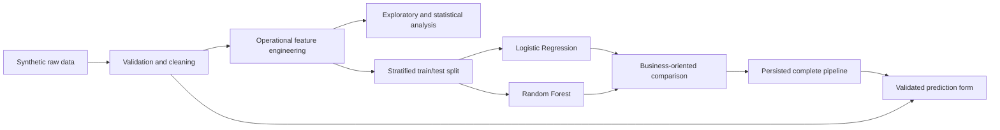

# Production Quality Dashboard and Defect Prediction

An end-to-end data science portfolio project for monitoring manufacturing quality and estimating defect risk with Python, Scikit-learn, Plotly, and Streamlit.

> **Synthetic data notice:** every production record in this repository is simulated. This application is a demonstration project, not a production quality-control system.

## 1. Project overview

This project simulates the workflow of a manufacturing quality team: generate imperfect operational data, clean and validate it, explore quality patterns, test an accessible statistical hypothesis, compare classification models, and communicate results through an interactive dashboard.

The use case is inspired by high-quality and luxury manufacturing, while remaining independent of any company, brand, proprietary process, or confidential dataset.

## 2. Business problem

A quality team needs to understand where defects occur and decide which products deserve additional inspection. Raw defect counts alone are misleading when production volumes differ, while a prediction without operational context is difficult to trust.

The project therefore combines:

- monitoring of counts, rates, volumes, and quality indicators;
- comparison by site, machine, material, operator team, shift, and time;
- analysis of operating conditions associated with defects;
- a defect-screening probability for inspection prioritisation;
- explicit warnings about uncertainty, causality, and synthetic data.

## 3. Objectives

- Build a reproducible dataset containing realistic operational relationships and deliberate quality problems.
- Create a documented cleaning and feature-engineering pipeline.
- Answer ten operational questions without confusing counts and rates.
- Test whether average temperature differs between defective and acceptable products.
- Compare interpretable Logistic Regression with non-linear Random Forest classification.
- Prioritise defect recall while keeping precision and review workload visible.
- Persist the complete preprocessing and prediction pipeline.
- Provide a clear dashboard for non-technical users.

## 4. Dataset description

The generator creates 2,500 unique production records and adds 15 duplicated records. The raw file therefore contains 2,515 rows. The cleaned file contains 2,500 rows and 18 columns, with an overall simulated defect rate of 13.56%.

| Column                | Meaning                                             |
| --------------------- | --------------------------------------------------- |
| `production_id`       | Unique production record identifier                 |
| `production_date`     | Production date and time                            |
| `site`                | Simulated production site                           |
| `machine_id`          | Machine assigned to the site                        |
| `operator_team`       | Production team                                     |
| `temperature`         | Machine temperature in °C                           |
| `pressure`            | Production pressure in bar                          |
| `production_duration` | Manufacturing duration in minutes                   |
| `material_type`       | Material category                                   |
| `quality_score`       | Post-production quality-control score from 0 to 100 |
| `defect`              | Binary target: 0 acceptable, 1 defective            |

The raw data deliberately contains 77 missing values, duplicated production IDs, impossible numeric values, invalid categories, and outliers. A fixed random seed makes generation reproducible.

The processed data adds:

- `production_month`, `production_day`, `production_weekday`, and `production_hour`;
- `production_shift` (`Morning`, `Afternoon`, or `Night`);
- `temperature_deviation` from 70°C;
- `pressure_deviation` from 5 bar.

`quality_score` is used only for retrospective analysis. It is excluded from prediction because it represents information obtained during or after quality inspection and would cause data leakage.

## 5. Repository structure

```text
.
├── data/
│   ├── raw/production_quality.csv
│   └── processed/production_quality_clean.csv
├── models/
│   ├── defect_model.joblib
│   └── model_metrics.json
├── notebooks/
│   └── exploratory_analysis.ipynb
├── reports/
│   └── figures/
├── src/
│   ├── __init__.py
│   ├── data_preparation.py
│   ├── evaluate_model.py
│   ├── features.py
│   ├── generate_data.py
│   ├── predict.py
│   └── train_model.py
├── tests/
│   ├── test_data_preparation.py
│   └── test_predict.py
├── app.py
├── requirements.txt
├── LICENSE
└── README.md
```

## 6. Installation

Python 3.10 or later is recommended.

### macOS and Linux

```bash
python -m venv .venv
source .venv/bin/activate
python -m pip install --upgrade pip
pip install -r requirements.txt
```

If the `python` command is not available, replace it with `python3`.

### Windows PowerShell

```powershell
py -m venv .venv
.venv\Scripts\Activate.ps1
python -m pip install --upgrade pip
pip install -r requirements.txt
```

### Windows Command Prompt

```bat
py -m venv .venv
.venv\Scripts\activate.bat
python -m pip install --upgrade pip
pip install -r requirements.txt
```

## 7. How to generate the dataset

```bash
python src/generate_data.py
```

Expected output includes the number of rows and columns, defect rate, missing-value count, duplicate count, and the path to `data/raw/production_quality.csv`.

The script exposes reusable functions for clean generation, issue injection, summary creation, and CSV persistence. Running it again with the default seed reproduces the same dataset.

## 8. How to clean the data

```bash
python src/data_preparation.py
```

The command prints JSON quality reports before and after cleaning, then saves `data/processed/production_quality_clean.csv`. The pipeline:

- removes duplicate production IDs;
- parses and validates timestamps;
- corrects invalid categories using documented vocabularies and machine-site mappings;
- replaces impossible numeric values and imputes medians;
- clips quality scores to 0–100;
- validates the binary target;
- creates the seven derived operational features.

Run the data and inference tests with:

```bash
pytest -q
```

## 9. How to train the models

```bash
python src/train_model.py
```

Training uses a reproducible 80/20 stratified split. Both candidates use a Scikit-learn `Pipeline` containing:

- median imputation and `StandardScaler` for numerical inputs;
- most-frequent imputation and `OneHotEncoder` for categorical inputs;
- class weighting to address target imbalance;
- either Logistic Regression or Random Forest classification.

The selected fitted pipeline is saved to `models/defect_model.joblib`. Dataset information, feature names, excluded leakage fields, classification reports, confusion matrices, selection rationale, coefficients, and limitations are saved to `models/model_metrics.json`.

Re-evaluate the persisted model on the same deterministic holdout split:

```bash
python src/evaluate_model.py
```

Run an example validated prediction:

```bash
python src/predict.py
```

## 10. How to launch the Streamlit dashboard

```bash
streamlit run app.py
```

The application contains three tabs:

1. **Production overview** — six KPIs, site volumes and rates, machine rates, and monthly defects.
2. **Quality analysis** — date, site, machine, team, material, and shift filters; condition distributions; group comparisons; and high-risk groups.
3. **Defect prediction** — validated production inputs, automatic time features, probability, risk category, classification, and contextual factors.

The interface handles empty filters, warns when the filtered sample contains fewer than 100 records, and displays clear messages if data or model artifacts are missing.

## 11. Methodology



All preprocessing is fitted inside each model pipeline using only the training split. The target, identifiers, timestamps, and post-inspection quality score are not model inputs. The default classification threshold is 0.50; it is a demonstration setting and must be calibrated against real inspection costs before operational use.

## 12. Exploratory-analysis questions

Open the notebook with:

```bash
jupyter notebook notebooks/exploratory_analysis.ipynb
```

The notebook answers:

1. What is the overall defect rate?
2. Which machine has the highest defect rate?
3. Which site has the highest defect rate?
4. How does the defect rate evolve over time?
5. Is temperature associated with defects?
6. Is pressure associated with defects?
7. Does production duration affect quality or defect risk?
8. Which material type has the highest defect rate?
9. Are some operator teams associated with more defects?
10. During which production shift are defects most frequent?

Each visualization includes a title, labelled axes, an interpretation, a business implication, and a caution. Production volume is shown beside group rates to reduce misleading comparisons.

## 13. Statistical analysis

The primary question is whether average machine temperature differs between acceptable and defective products.

- **Null hypothesis:** both groups have the same average temperature.
- **Alternative hypothesis:** their average temperatures differ.
- **Test:** Welch's independent-samples t-test, selected because the groups are independent and large but have unequal variances.
- **Acceptable products:** mean 70.27°C, 2,161 records.
- **Defective products:** mean 71.03°C, 339 records.
- **Result:** `t = 1.861`, `p = 0.064`.
- **Effect size:** Cohen's `d = 0.141`, a small standardized difference.

At the 5% level, the analysis does not reject the null hypothesis. Average temperature alone does not clearly separate the groups, although deviation from normal temperature remains useful in combination with other variables.

An optional machine-versus-defect chi-square test gives `χ² = 39.162`, `p < 0.001`. This indicates an association in the synthetic sample, not proof that a machine causes defects. Statistical significance never establishes causation.

## 14. Model evaluation

Metrics below describe the 500-record holdout set at a 0.50 threshold.

| Model               | Precision (defect) | Recall (defect) |        F1 |   ROC-AUC |    PR-AUC |
| ------------------- | -----------------: | --------------: | --------: | --------: | --------: |
| Logistic Regression |              0.235 |       **0.618** | **0.340** |     0.716 |     0.318 |
| Random Forest       |          **0.375** |           0.132 |     0.196 | **0.722** | **0.356** |

Confusion matrices, ordered as `[[TN, FP], [FN, TP]]`:

- Logistic Regression: `[[295, 137], [26, 42]]`
- Random Forest: `[[417, 15], [59, 9]]`

The final model is **Logistic Regression** because it detects 61.8% of holdout defects versus 13.2% for Random Forest at the operating threshold. In a screening context, missing a defective item can be more costly than reviewing a false alert. This decision is not a claim that recall is universally best: Logistic Regression produces 137 false alerts and only 23.5% precision, so inspection capacity and failure costs must determine the real threshold.

Random Forest has slightly better ROC-AUC and PR-AUC, showing that ranking quality and thresholded classification answer different questions. Threshold calibration on a validation set would be a sensible next step with real cost information.

## 15. Main findings

- The simulated overall defect rate is 13.56%.
- M-06 has the highest observed machine rate (21.20%); M-07 follows at 19.45%.
- Besancon has the highest site rate (14.62%), while Lyon has the largest volume.
- Ceramic has the highest material rate (19.16%).
- Afternoon has the highest shift rate (14.68%) and defect count (128).
- Defective records have higher average pressure and longer average duration, with substantial overlap.
- Temperature deviation, pressure deviation, M-07, M-06, M-03, and ceramic material are linked to higher predicted risk in the selected model.
- Logistic Regression coefficients describe conditional associations. They do not demonstrate that these factors cause defects.

## 16. Business recommendations

- Investigate M-06 and M-07 with maintenance records, calibration checks, product mix, and operator feedback.
- Monitor absolute deviation from standard temperature and pressure rather than relying only on raw averages.
- Review material-specific operating windows for ceramic production.
- Use predicted risk to prioritise inspection, never to replace inspection.
- Track both missed defects and false alerts when choosing an operating threshold.
- Validate findings with production experts and controlled process studies.
- Collect real industrial data before making investments or changing procedures.

## 17. Limitations

- All data and relationships are synthetic.
- Model performance on simulated data does not guarantee real-world performance.
- The holdout sample is modest, with 68 defective products.
- Random train/test splitting does not measure future-time drift or unseen-machine generalisation.
- Maintenance history, supplier batches, product references, inspection type, and repeated operator context are absent.
- Group comparisons are unadjusted and can be confounded by site, machine, material, or shift allocation.
- Impurity-based Random Forest importance can favour continuous or high-cardinality features.
- The 0.50 decision threshold is not based on real operational cost data.
- Correlation and predictive importance do not establish causation.

## 18. Ethical and operational considerations

The dashboard must not be used to rank or penalise operator teams. A team-level association may reflect assignments, equipment, materials, shifts, or unmeasured process conditions. Human production expertise, physical inspection, and documented escalation procedures remain essential.

Before operational use, a real implementation would require data governance, access control, audit logs, monitoring for drift and disparate impact, model versioning, threshold approval, fallback procedures, and periodic review with quality and production specialists.

## 19. Possible improvements

- Replace synthetic records with governed, de-identified industrial data.
- Add maintenance events, supplier batches, product references, rework, inspection types, and defect severity.
- Use time-based validation and hold out entire machines or sites to test generalisation.
- Tune the decision threshold from the cost of missed defects and manual reviews.
- Add calibrated probabilities and confidence intervals for group rates.
- Compare permutation importance with impurity importance.
- Add data-drift and model-performance monitoring.
- Store records and prediction audits in SQLite as a lightweight extension.
- Add integration tests for model artifacts and dashboard data loading.

## 20. CV-ready project description

### Analyse et prédiction des défauts de production

Projet personnel — Python, Pandas, Scikit-learn, Plotly, Streamlit

- Génération, nettoyage et analyse exploratoire d’un jeu de données industriel synthétique comprenant plus de 2 000 observations.
- Création d’indicateurs de suivi de la qualité par site, machine, matériau, équipe et période.
- Réalisation d’une analyse statistique des conditions de production associées aux défauts.
- Comparaison de modèles de régression logistique et de Random Forest pour estimer le risque de défaut.
- Évaluation des modèles avec les métriques de précision, rappel, score F1, ROC-AUC et PR-AUC.
- Développement d’un tableau de bord Streamlit destiné à des utilisateurs non techniques.
- Documentation des résultats, des limites du modèle et des recommandations opérationnelles.

## License

This project is available under the MIT License. See `LICENSE`.
